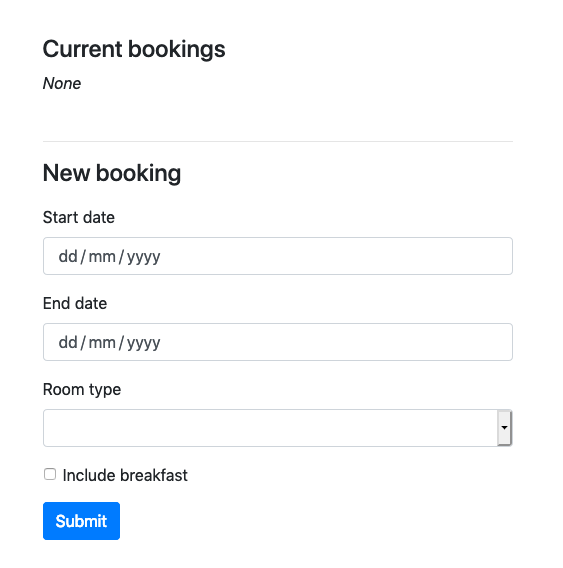

The following are examples of integrating `typesystem` against a Web framework.

## API validation & serialization

Using typesystem for validation and serialization of a simple Web API.

**requirements.txt**

```
starlette
typesystem
uvicorn
```

**app.py**

```python
from starlette.applications import Starlette
from starlette.responses import JSONResponse
from starlette.routing import Route
import typesystem
import uvicorn

users = []


class User(typesystem.Schema):
    username = typesystem.String(max_length=100)
    is_admin = typesystem.Boolean(default=False)


async def list_users(request):
    return JSONResponse({"users": [dict(user) for user in users]})


async def add_user(request):
    data = await request.json()
    user, errors = User.validate_or_error(data)
    if errors:
        return JSONResponse(dict(errors), status_code=400)
    users.append(user)
    return JSONResponse(dict(user))


app = Starlette(debug=True, routes=[
    Route('/', list_users, methods=["GET"]),
    Route('/', add_user, methods=["POST"]),
])


if __name__ == "__main__":
    uvicorn.run(app)
```

## Form rendering

Using typesystem for a simple Web submission page.



**requirements.txt**

```
aiofiles          # Static files support
boostrap4         # Form templates & static files
jinja2            # Form rendering
python-multipart  # Form parsing
starlette
typesystem
uvicorn
```

**app.py**

```python
from starlette.applications import Starlette
from starlette.responses import RedirectResponse
from starlette.routing import Route, Mount
from starlette.staticfiles import StaticFiles
from starlette.templating import Jinja2Templates
import typesystem
import uvicorn

forms = typesystem.Jinja2Forms(package="bootstrap4")
templates = Jinja2Templates(directory="templates")
statics = StaticFiles(directory="statics", packages=["bootstrap4"])
bookings = []


class BookingSchema(typesystem.Schema):
    start_date = typesystem.Date(title="Start date")
    end_date = typesystem.Date(title="End date")
    room = typesystem.Choice(
        title="Room type",
        choices=[
            ("double", "Double room"),
            ("twin", "Twin room"),
            ("single", "Single room"),
        ],
    )
    include_breakfast = typesystem.Boolean(title="Include breakfast", default=False)

    def __str__(self):
        breakfast = (
            "(with breakfast)" if self.include_breakfast else "(without breakfast)"
        )
        return f"Booking for {self.room} from {self.start_date} to {self.end_date}"


async def homepage(request):
    form = forms.Form(BookingSchema)
    context = {"request": request, "form": form, "bookings": bookings}
    return templates.TemplateResponse("index.html", context)


async def make_booking(request):
    data = await request.form()
    booking, errors = BookingSchema.validate_or_error(data)
    if errors:
        form = forms.Form(BookingSchema, values=data, errors=errors)
        context = {"request": request, "form": form, "bookings": bookings}
        return templates.TemplateResponse("index.html", context)

    bookings.append(booking)
    return RedirectResponse(request.url_for("homepage"))


app = Starlette(
    debug=True,
    routes=[
        Route("/", homepage, methods=["GET"]),
        Route("/", make_booking, methods=["POST"]),
        Mount("/statics", statics, name="static"),
    ],
)


if __name__ == "__main__":
    uvicorn.run(app)
```

**templates/index.html**

```html
<!doctype html>
<html lang="en">
  <head>
    <meta charset="utf-8">
    <meta name="viewport" content="width=device-width, initial-scale=1, shrink-to-fit=no">
    <meta name="description" content="">
    <meta name="author" content="">
    <title>TypeSystem</title>
    <link href="{{ url_for('static', path='/css/bootstrap.min.css') }}" rel="stylesheet">
    <link href="{{ url_for('static', path='/css/base.css') }}" rel="stylesheet">
  </head>

  <body>
    <main role="main" class="container">
      <div class="booking-list">
        <h4>Current bookings</h4>
        <div>
            
            <ul>
                <li>{{ booking }}</li>
            </ul>
            
            <em>None</em>
            
        </div>
      </div>
      <hr/>
      <div class="booking-form">
        <h4>New booking</h4>
        <form method="POST">
          {{ form }}
          <div class="submit-controls">
            <button type="submit" class="btn btn-primary">Submit</button>
          </div>
        </form>
      </div>
    </main>

    <script src="https://code.jquery.com/jquery-3.2.1.slim.min.js" integrity="sha384-KJ3o2DKtIkvYIK3UENzmM7KCkRr/rE9/Qpg6aAZGJwFDMVNA/GpGFF93hXpG5KkN" crossorigin="anonymous"></script>
    <script src="https://cdnjs.cloudflare.com/ajax/libs/popper.js/1.12.9/umd/popper.min.js" integrity="sha384-ApNbgh9B+Y1QKtv3Rn7W3mgPxhU9K/ScQsAP7hUibX39j7fakFPskvXusvfa0b4Q" crossorigin="anonymous"></script>
    <script src="{{ url_for('static', path='js/bootstrap.min.js') }}"></script>
  </body>
</html>
```

**statics/css/base.css**

```css
.container {
    padding-top: 20px;
    max-width: 500px;
}

.booking-list {
    padding: 20px 0 30px;
}

.booking-list li {
    padding: 10px 0;
}

.booking-form form {
    padding: 10px 0;
}

.submit-controls {
    padding: 15px 0;
}
```
