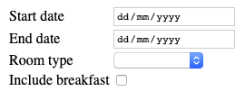
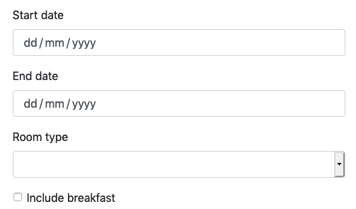

TypeSystem gives you form rendering support, which you can either style and
customize yourself, or use together with a pre-packaged theme.

Let's take a look:

```python
import typesystem

forms = typesystem.Jinja2Forms(package="typesystem")  # Use the default templates.

class BookingSchema(typesystem.Schema):
    start_date = typesystem.Date(title="Start date")
    end_date = typesystem.Date(title="End date")
    room = typesystem.Choice(title="Room type", choices=[
        ('double', 'Double room'),
        ('twin', 'Twin room'),
        ('single', 'Single room')
    ])
    include_breakfast = typesystem.Boolean(title="Include breakfast", default=False)

form = forms.Form(BookingSchema)
print(form)
```

That'll render an HTML form which looks something like this:



The default templates included by `typesystem` use tables to provide a simple
functional layout.

Notice that only the fields in the form are rendered. The surrounding `<form>`, `<table>`, and `<input type="submit">` tags should be included directly in any template that renders the form.

```html
<tr>
    <td>
        <label for="form-bookingschema-start-date">Start date</label>
    </td>
    <td>
        <input type="date" id="form-bookingschema-start-date" name="start_date" required>
    </td>
</tr>
<tr>
    <td>
        <label for="form-bookingschema-end-date">End date</label>
    </td>
    <td>
        <input type="date" id="form-bookingschema-end-date" name="end_date" required>
    </td>
</tr>
<tr>
    <td>
        <label for="form-bookingschema-room">Room type</label>
    </td>
    <td>
        <select id="form-bookingschema-room" name="room">
            <option></option>
            <option value="double">Double room</option>
            <option value="twin">Twin room</option>
            <option value="single">Single room</option>
        </select>
    </td>
</tr>
<tr>
    <td>
        <label for="form-bookingschema-include-breakfast">Include breakfast</label>
    </td>
    <td>
        <input type="checkbox" id="form-bookingschema-include-breakfast" name="include_breakfast" value="true">
    </td>
</tr>
```

You can include a form inside a Jinja2 template by passing it as context,
and rendering the context value. Make sure to include the surrounding tags:

```html
<form action="/" method="POST">
    <table>
        {{ form }}
        <tr>
            <td></td>
            <td><input type="submit" value="Make booking"/></td>
        </tr>
    </table>
</form>
```

## Including values and errors

We can include values in a form like so:

```python
initial_values = {'room': 'double', 'include_breakfast': True}
form = forms.Form(BookingSchema, values=initial_values)
```

We can also include validation errors:

```python
booking, errors = BookingSchema.validate_or_error(data)
if errors:
    form = forms.Form(BookingSchema, values=data, errors=errors)
```

## Customizing field rendering

If you'd like to override the default field rendering you can switch to
using your own custom templates. Switch this line:

```python
forms = typesystem.Jinja2Forms(package="typesystem")
```

To instead use a `templates` directories:

```python
forms = typesystem.Jinja2Forms(directory="templates")
```

You'll need to provide the following templates:

* `forms/checkbox.html`
* `forms/input.html`
* `forms/select.html`
* `forms/textarea.html`

## Using a packaged theme

You can also use a pre-packaged theme, such as Bootstrap 4:

```shell
# This pypi package includes `typesystem` form templates,
# and pre-packaged static files.
$ pip install bootstrap4
```

```python
forms = typesystem.Jinja2Forms(package="bootstrap4")
```

The `bootstrap4` package also provides the static CSS and JavaScript files,
which you can easily serve up from Starlette's `StaticFiles` application:

```python
# Serve everything in the local "statics" directory plus everything
# in the "statics" directory of the `bootstrap4` package.
statics = StaticFiles(directory="statics", packages=["bootstrap4"])
```

That will then render HTML forms using Bootstrap:


